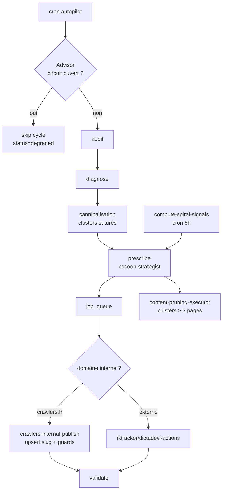

## Parménion v3 — Orchestrateur Breathing Spiral (post-fix 2026-04-27)

### Auto-trigger Crawl (2026-05-24)

**Problème racine** : Parménion consomme les données crawl via `cocoon-diag-semantic` / `audit-expert-seo` mais ne déclenchait jamais de crawl. Si `site_crawls` était vide ou obsolète (ex. Dictadevi, dernier crawl 23 avril → 1 mois), tous les cycles produisaient 0 findings → workbench vide → 0 publications.

**Correction** : phase 0bis dans `parmenion-orchestrator` (avant audit/diagnose). Si `currentPhase ∈ {audit, diagnose}` et dernier `site_crawls.completed` > 14j (ou absent) :
1. Fire-and-forget `crawl-site` (mode analyze, maxPages=80, forceRefresh=true) avec `bodyUserId`
2. Insert `parmenion_decision_log` (status=degraded, action_type=crawl_refresh)
3. Return `{ skipped: true, reason: 'crawl_refresh_triggered' }` → cycle reporté

Si un crawl est `pending`/`processing` → cycle reporté (`reason: crawl_in_flight`). Si frais (<14j) → continue normalement.


### Vue d'ensemble
Parménion (v3) est l'unique macro-orchestrateur de la **Breathing Spiral**, capable de piloter le cycle complet (Audit → Diagnostic → Prescription → Exécution → Validation). Il utilise le `spiral_score` pour prioriser les actions et un dual-lane scoring (tech + contenu) avec budget partagé configurable.

### EXECUTE déterministe V3 (2026-05-21)

**Problème racine** : la phase `execute` appelait `askParmenionLLM` librement → le LLM oubliait souvent d'émettre `cms_actions` ("No cms_actions and no JS fixes in payload"), donc le plan PRESCRIBE V3 (loggé avec `_prescribe_v3` + `strategist_task`) restait lettre morte sur Dictadevi/IKtracker.

**Correction** : `parmenion-orchestrator` (branche EXECUTE) fetch maintenant le **dernier `parmenion_decision_log` phase=prescribe** pour le domaine, et si son `action_payload._prescribe_v3 === true`, il rejoue déterministiquement le `strategist_task` (zéro LLM execute). L'adapter `buildV3CmsActionsForIktracker` dans `autopilot-engine` (lignes 60-125) convertit ensuite le task en `create-post` réel via `runEditorialPipeline`. Le LLM execute n'est appelé qu'en fallback si aucun plan V3 disponible.

**Anti double-execute guard (2026-05-21)** : avant de rejouer un prescribe V3, le bridge vérifie qu'aucun `parmenion_decision_log` phase=execute avec statut `completed|partial|degraded` ne référence déjà ce prescribe via `action_payload->>_from_prescribe_decision_id`. Si oui → skip déterministe + fallback LLM. Empêche la double-publication d'un même `strategist_task` si plusieurs cycles execute s'enchaînent.

Payload émis : `{ _prescribe_v3: true, _execute_deterministic: true, strategist_task, _from_prescribe_decision_id }`.

### Périmètre du mode dry_run (v3.6 — 2026-04-27)

**Problème racine** : `implementation_mode='dry_run'` court-circuitait **toutes les phases** (audit, diagnose, prescribe, validate), pas seulement le push CMS. Conséquence : 30 cycles "verts" sur dictadevi.io sans aucun audit réel ni alimentation du workbench.

**Correction** : `dry_run` ne bloque désormais **que la phase `execute`** (push CMS).

| Phase | dry_run avant | dry_run après |
|---|---|---|
| audit | ❌ skip | ✅ exécutée |
| diagnose | ❌ skip | ✅ exécutée |
| prescribe | ❌ skip | ✅ exécutée (workbench alimenté) |
| **execute** | ❌ skip | ❌ **skip (inchangé)** |
| validate | ❌ skip | ✅ exécutée |

**Logique** (`autopilot-engine/index.ts` ~ligne 248) :
```ts
const isDryRunBlocked = config.implementation_mode === 'dry_run' && phase === 'execute';
if (!isPrescribeV2 && !isDryRunBlocked && decision.action?.functions?.length > 0) {
  await executeFunctions(...)
}
```

Le statut `'dry_run'` dans `parmenion_decision_log.status` n'est désormais émis que pour la phase `execute`. Les autres phases reflètent leur exécution réelle (`completed`, `degraded`, `failed`).

### Onglet "Exécution" (admin Parménion, v3.6)

`src/components/Admin/ParmenionExecutionStatus.tsx` — onglet par défaut du dashboard. Pour chaque site branché :
- Mode actuel (Dry-run / Auto / Review) avec rappel de ce qui est bloqué
- Numéro du dernier cycle + total cycles + horodatage
- Pipeline visuel 5 chips (audit/diagnose/prescribe/execute/validate) avec statut réel par phase au dernier cycle
- Note pédagogique sous les sites en dry_run


### Pré-score déterministe (v3.5 — 2026-04-15)

Parménion appelle `computeSeoScoreV2` (import `_shared/seoScoringV2.ts`) en phases **audit** et **prescribe** pour obtenir un score baseline de la homepage du domaine **avant** les audits LLM coûteux. Ce score (0-100, 7 axes) est :
- Injecté dans le prompt LLM comme contexte `## SCORE SEO BASELINE`
- Retourné dans la réponse JSON (`baseline_seo_score`)
- Calculé en ~5ms, 0 token LLM, avec les `customKeywords` du `keyword_universe` du site
- Non-bloquant : si le fetch échoue (timeout 8s), le pipeline continue sans score

### Skip-Audit intelligent (v3.4 — 2026-04-15)

**Problème racine** : Parménion et Agent SEO utilisaient les mêmes fonctions d'audit (`audit-expert-seo`, `check-eeat`), doublant les appels LLM sans valeur ajoutée.

**Correction Option A** : Parménion détecte les items workbench `source_function='agent-seo'` de moins de 24h en phase audit. S'il en trouve, il **saute directement en prescribe** sans ré-auditer.

**Logique** :
- Phase `audit` → Query `architect_workbench` WHERE `source_function='agent-seo'` AND `status IN ('pending','in_progress')` AND `created_at > now() - 24h`
- Si ≥1 résultat → `currentPhase = 'prescribe'`
- Sinon → audit normal (3 fonctions en parallèle)

### Agent SEO enrichi (v3.4)
Agent SEO lance désormais **3 fonctions en parallèle** (comme Parménion) :
1. `audit-expert-seo` — Audit technique
2. `check-eeat` — Évaluation E-E-A-T
3. `strategic-orchestrator` — Audit stratégique GEO (mots-clés, quick wins, concurrents, SERP)

Les résultats stratégiques (quick wins, gaps, concurrents) sont injectés dans le contexte LLM de l'Agent SEO.

### Phase AUDIT enrichie (v3.3 — 2026-04-15)

**Problème racine** : Parmenion n'appelait que `audit-expert-seo` en phase audit, produisant un diagnostic mono-dimensionnel. Résultat : contenus répétitifs, pas de vision marché, pas de mots-clés quick-win.

**Correction** : La phase audit lance désormais **3 fonctions en parallèle** :
1. `audit-expert-seo` — Audit technique pur (performance, indexabilité, erreurs)
2. `strategic-orchestrator` — Audit stratégique GEO complet (mots-clés, quick wins, concurrents, SERP)
3. `check-eeat` — Évaluation E-E-A-T (expertise, autorité, fiabilité)

**Fichiers modifiés** :
- `_shared/parmenion/types.ts` — `PHASE_FUNCTIONS.audit` inclut `strategic-orchestrator`
- `parmenion-orchestrator/index.ts` — Prompt audit demande les 3 fonctions, fallback les 3 + skip-audit logic
- `autopilot-engine/index.ts` — Mapping payload spécifique pour `strategic-orchestrator` (sync) et `check-eeat`
- `agent-seo/index.ts` — Appelle `strategic-orchestrator` en parallèle avec les 2 autres audits

### Droits CMS interne crawlers.fr

| Agent | blog_articles | seo_page_drafts |
|---|---|---|
| **Parménion** | CRUD (via cms-publish-draft + cms-patch-content) | CRUD (via cms-publish-draft) |
| **Agent SEO** | SELECT only | INSERT (landings) |
| **generate-blog-from-news** | INSERT (articles auto) | — |

### FIX critique v3.2 (2026-04-12) — 6 corrections
(inchangé — voir historique)

### Limites
- Max 10 actions CMS par cycle
- Max 4 tool calls par prompt LLM
- 2 prompts LLM max par micro-cycle (technique + contenu)
- 8 items max scorés par cycle (répartis entre les 2 lanes)
- Polling async : 90s max, intervalle 5s
- Watchdog cycle : 8.5 minutes max

### Retry LLM (v3.1)
callLLMWithTools utilise 3 tentatives :
1. Modèle principal + `tool_choice: 'required'` (temp 0.2)
2. Même modèle + `tool_choice: 'auto'` (temp 0.3)
3. Fallback `gemini-2.5-flash` + `tool_choice: 'required'` (temp 0.3)

### Exécution CMS par plateforme
- **IKtracker** : exécution complète (CRUD articles/pages, meta, code, redirections)
- **WordPress/Shopify** : partiel (cms-push-draft, cms-patch-content, cms-push-code)
- **Wix/Webflow** : lecture seule (audit/diagnostic uniquement)

---

## v3.7 — Stabilisation & robustesse (août 2026, lots A/B)

Audit des 24 h précédentes : `dictadevi.io` bloqué en `running`, doublon de config `iktracker.fr`, 130 jobs `content-architecture-advisor` en échec (CPU time), spirale muette, pruning interne KO sur `crawlers.fr`.

### A1 — Circuit breaker Advisor (`autopilot-engine`)
Si `content-architecture-advisor` échoue **3 fois en 3 h** pour un domaine, le cycle est **skippé** (`status='degraded'`, action_type=`advisor_circuit_open`) au lieu de reboucler et brûler du CPU time. Réarmement automatique après la fenêtre de 3 h.

### A2 — Publication interne atomique (`crawlers-internal-publish`)
- `upsert` atomique sur `slug` (fin des races entre deux cycles concurrents)
- Guards qualité : refus si contenu < **1500 caractères** ou titre déjà présent dans `blog_articles`
- Image générée puis rattachée après acceptation de l'article

### A3 — Nettoyage d'état
Configs coincées en `running` → `idle`, désactivation du doublon `iktracker.fr`, purge des jobs advisor en échec.

### B1 — Bridge de pruning interne (`content-pruning-executor`)
`crawlers.fr` est traité en interne (lecture/écriture directes sur `blog_articles`) au lieu du bridge CMS externe — fin des erreurs 424. Les plateformes sans redirection gardent le garde-fou « pas de suppression sans 301 ».

### B2 — Sélection de pruning resserrée (`parmenion-orchestrator`)
Candidats au pruning limités aux clusters de **≥ 3 pages** : les petits clusters sains ne sont plus consolidés inutilement.

### B3 — Spirale : cron et filtrage
- `compute-spiral-signals` : auth par `apikey` / `service_role_key` (fin des 401), exécution sans session utilisateur autorisée, throttle **1 run / 60 min**, cron toutes les 6 h avec `{"all": true}`
- Correction du filtrage sur une colonne inexistante (`tracked_sites.is_active`) → cible désormais les sites ayant des items workbench `pending`
- Binding cluster : `match_workbench_cluster` + trigger, backfill 54 items / 29 clusters

### Flux consolidé



### Points de vigilance restants (lot C)
- Coûts OpenRouter non tracés dans le ledger (génération d'images Gemini 3 Flash)
- Télémétrie d'erreur encore partielle sur les jobs `queue-worker-every-min`
