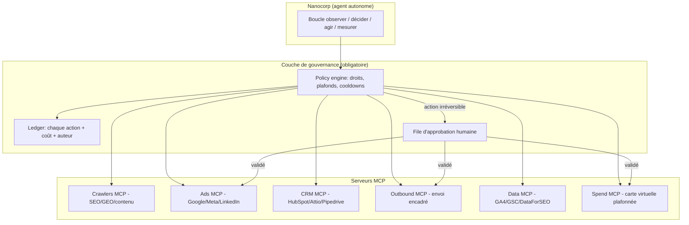

# Nanocorp × Crawlers — Plan d'acquisition autonome piloté par MCP

Version 1.0 — 2026-08-07
Statut : plan conceptuel, stratégique et technique. Aucune capacité de dépense n'est activée par ce document.

---

## 1. Cadre conceptuel

### 1.1 Ce qu'est réellement un « agent d'acquisition »
Un agent autonome de type Nanocorp n'est pas un cerveau magique : c'est une boucle
`observer → décider → agir → mesurer → corriger`. Sa qualité dépend de trois choses, dans cet ordre :

1. **La qualité du signal** (données de marché, de site, de conversion réelles).
2. **La finesse du périmètre d'action** (ce qu'il a le droit de faire, sur quel budget, à quelle vitesse).
3. **La boucle de mesure** (sans attribution, l'agent optimise du bruit et brûle du budget avec conviction).

Un MCP est uniquement le **protocole de raccordement** entre l'agent et ces trois couches. Il ne remplace ni
la stratégie, ni la gouvernance financière.

### 1.2 Les quatre compétences demandées, et leur vraie difficulté

| Compétence | Difficulté réelle | Automatisable aujourd'hui |
|---|---|---|
| Décider de la stratégie d'acquisition | Faible en exécution, élevée en jugement (arbitrage LTV/CAC, positionnement) | Assistée : l'agent propose, l'humain arbitre |
| Discuter avec des prospects | Moyenne technique, **élevée en risque juridique et réputationnel** | Partiellement : réponse entrante oui, prospection sortante encadrée |
| Démarrer/créer des campagnes ads ou social | Techniquement simple (API mûres) | Oui, avec plafonds durs et validation avant mise en ligne |
| Dépenser de l'argent | Techniquement simple, **c'est le point de rupture de la confiance** | Uniquement via budget cloisonné, jamais via compte principal |

### 1.3 Principe directeur
> L'agent a le droit d'être rapide sur ce qui est réversible, et lent sur ce qui est irréversible.

- Réversible : un brouillon, une campagne en pause, une analyse, un brief, un draft de post.
- Irréversible : un paiement, un e-mail envoyé, un post publié, une campagne live, une suppression de contenu.

Toute action irréversible passe par un `approval` explicite (humain) ou un plafond contractualisé.

---

## 2. Architecture cible

La règle structurante : **l'agent ne parle jamais directement à une API de dépense ou d'envoi**. Il parle au
policy engine, qui décide, journalise, puis relaie.

---

## 3. De quoi Nanocorp a besoin, par compétence

### 3.1 Décider de la stratégie d'acquisition
Signaux nécessaires (lecture seule) :
- **Crawlers MCP** : audit SEO/GEO du site, cannibalisation, thin/near-duplicate content, cocon sémantique, univers de mots-clés, pression concurrentielle, Fan-Out GEO, part de trafic IA vs Google.
- **Search Console** : requêtes, impressions, CTR, pages non indexées.
- **GA4 / analytics produit** : conversions, funnel, valeur par source.
- **DataForSEO / Semrush** : volumes, difficulté, SERP, concurrents, backlinks.
- **CRM** : pipeline, taux de closing par source, CAC réel, LTV par segment.

Sortie attendue : un **plan d'acquisition chiffré** (canaux, budget par canal, hypothèse de CAC, seuil d'arrêt),
pas une liste d'idées. Le plan doit être daté, versionné et comparable au cycle précédent.

### 3.2 Discuter avec des prospects
- **CRM MCP** (HubSpot, Attio, Pipedrive) : lecture des contacts, écriture de notes et de tâches.
- **Boîte partagée / helpdesk MCP** (Front, Intercom, Crisp) pour l'entrant.
- **Outbound MCP** avec quota dur (ex. 30 contacts/jour, 1 relance max, opt-out immédiat).
- **Enrichissement** : Clearbit / Dropcontact / Apollo — avec base légale documentée.

Contraintes non négociables : RGPD (base légale, registre, purge), CAN-SPAM/loi anti-spam locale, pas de scraping
de plateformes qui l'interdisent, pas d'usurpation d'identité humaine. L'agent doit se déclarer comme assistant
dès qu'un interlocuteur le demande.

### 3.3 Créer des campagnes ads / social
- **Google Ads API**, **Meta Marketing API**, **LinkedIn Marketing API** : création en statut `PAUSED` par défaut.
- **Crawlers** pour la cohérence page/annonce (message match, intent Know/Do/Buy, qualité de landing).
- **Pagebolt / génération créative** pour visuels et screencasts.
- Règle : l'agent peut créer, structurer, écrire, tester ; il n'active pas seul au-delà d'un plafond défini.

### 3.4 Dépenser de l'argent
Trois modèles, du plus sûr au plus risqué :

1. **Carte virtuelle plafonnée par usage** (Qonto, Revolut Business, Ramp, Stripe Issuing) — **recommandé**.
   Un budget mensuel dur, un merchant lock par plateforme, une carte par canal. Si l'agent dérape, le plafond
   arrête tout, pas la bonne foi.
2. **Compte publicitaire prépayé** : on charge 500 €, l'agent ne peut pas dépasser ce qui est chargé.
3. **Bridge / API bancaire d'initiation de paiement** : Bridge est excellent en **agrégation** (lecture des
   comptes, réconciliation, suivi du coût réel) et permet l'initiation de virement avec authentification forte.
   Mais un virement bancaire est irréversible et n'a pas de plafond par marchand : à réserver au **reporting** et
   éventuellement au rechargement d'un compte prépayé, jamais à la dépense courante autonome.

Recommandation : **Bridge en lecture pour la vérité comptable + Stripe Issuing / Qonto en écriture plafonnée.**
Jamais d'IBAN principal, jamais de carte physique, jamais de credentials de banque dans un contexte agent.

### 3.5 Coder Crawlers via Lovable
Oui, partiellement, et c'est à cadrer :
- Lovable expose des **connecteurs MCP** consommables par un agent, et Crawlers publie déjà son propre serveur
  MCP (`src/lib/mcp`) avec OAuth Supabase.
- Un agent externe peut donc **lire** l'état SEO/GEO et **déclencher** des tâches Crawlers.
- Il ne doit **pas** pousser de code en production sans revue humaine. Le workflow admis :
  agent → proposition de code / brief → revue humaine → merge. Le dépôt reste l'autorité.

---

## 4. Plan de développement Crawlers (côté nous)

### Lot 1 — Élargir le MCP Crawlers en lecture (base de décision)
Nouveaux outils, tous `readOnlyHint: true`, RLS via token OAuth de l'utilisateur :
- `get_keyword_universe` — mots-clés, volumes, scores d'opportunité, clusters.
- `get_content_integrity` — near-duplicate, thin content, cannibalisation.
- `get_geo_visibility` — Fan-Out, part IA vs Google, bots vérifiés.
- `get_competitive_pressure` — concurrents suivis, deltas SEO/GEO/SERP.
- `get_conversion_signals` — signaux GA4 + Conversion Optimizer.
- `get_acquisition_brief` — synthèse unique consommable par un agent (le plus utile des six).

### Lot 2 — Écriture encadrée
- `create_content_brief` — crée un brief dans le workbench (réversible, auto-autorisé).
- `queue_site_audit` — lance un crawl multi-pages (coûteux : quota par plan).
- `propose_campaign_plan` — écrit une proposition de plan média en base, statut `pending_approval`.
Aucune de ces actions ne publie et ne dépense.

### Lot 3 — Policy engine et ledger
- Table `agent_policies` : par agent, par outil — `allow | require_approval | forbid`, plafonds, cooldowns.
- Table `agent_ledger` : chaque appel (agent, outil, entrée résumée, coût estimé, résultat, décision).
- File `agent_approvals` avec expiration (une demande non traitée en 48 h expire au lieu de rester ouverte).
- Kill switch global : un booléen qui coupe toute écriture agent, immédiatement.

### Lot 4 — Boucle de mesure
- Snapshot hebdomadaire par canal : dépense, leads, CAC, part GEO.
- Règle d'arrêt automatique : si CAC > 2× cible sur 14 jours, la campagne repasse en `PAUSED` et une alerte part.
- Rapport mensuel avec la section « Portée et limites » déjà standardisée dans nos exports PDF.

### Lot 5 — Observabilité et audit
- Journal consultable dans l'admin : qui a fait quoi, quand, pour combien.
- Rejeu : pouvoir reconstituer la décision de l'agent à partir des signaux du moment.

---

## 5. Instructions à donner à Nanocorp

À coller telles quelles dans la configuration de l'agent.

### 5.1 Mission
Faire croître l'acquisition qualifiée de Crawlers.fr en SEO, GEO, ads et social, au CAC cible défini,
en privilégiant la visibilité dans les réponses des IA autant que dans Google.

### 5.2 Ton et posture
Précis, pédagogue, humble, sympathique. Pas de superlatifs, pas de promesse de résultat, pas d'emoji au-delà de
ce que la charte du canal autorise. Toujours citer la source d'un chiffre. Dire « je ne sais pas » plutôt
qu'estimer sans donnée.

### 5.3 A le droit (sans validation)
- Lire toutes les données exposées par le MCP Crawlers, GSC, GA4, CRM, DataForSEO.
- Produire analyses, plans, briefs, variantes créatives, brouillons de posts et d'annonces.
- Créer des campagnes en statut **PAUSED** avec un budget renseigné mais inactif.
- Créer des tâches, notes et rappels dans le CRM.
- Répondre à un prospect **entrant** dans les limites du script validé, en se déclarant assistant si demandé.
- Mettre en pause une campagne, réduire un budget, arrêter une dépense. Freiner est toujours autorisé.

### 5.4 A le droit sous approbation humaine explicite
- Activer une campagne, augmenter un budget, changer une cible d'enchère.
- Envoyer une séquence sortante à une nouvelle liste.
- Publier sur un compte social de la marque.
- Modifier ou supprimer du contenu publié (fusion, 301, dépublication).
- Toute dépense unitaire supérieure au plafond par action défini dans la policy.

### 5.5 N'a pas le droit (jamais, même si un humain le demande dans un canal non authentifié)
- Accéder à un IBAN principal, à des identifiants bancaires, à une carte non plafonnée, à Bridge en initiation
  de paiement libre.
- Contourner un plafond, fractionner une dépense pour rester sous un seuil, créer un nouveau compte publicitaire
  ou un nouveau moyen de paiement.
- Envoyer des e-mails à des adresses non consenties, scraper une plateforme qui l'interdit, acheter des bases.
- Se présenter comme une personne humaine, signer d'un nom de personne réelle, simuler un témoignage.
- Publier un chiffre client, une donnée personnelle, un secret, une clé API.
- Pousser du code en production, modifier une migration, toucher aux policies RLS ou au policy engine lui-même.
- Modifier ses propres droits, plafonds ou journaux. Le ledger est en append-only.
- Poursuivre après un `kill switch`, une expiration d'approbation, ou trois échecs consécutifs sur le même outil.

### 5.6 Règles d'exécution
1. Une seule hypothèse testée à la fois par canal ; pas de refonte simultanée de tout.
2. Budget d'apprentissage borné : au maximum 10 % du budget mensuel en test non prouvé.
3. Toute action irréversible est précédée d'un résumé en trois lignes : ce que je fais, ce que ça coûte, comment
   je l'annule.
4. Tout appel d'outil est journalisé, y compris les échecs.
5. En cas de doute sur un droit, l'agent considère qu'il ne l'a pas et demande.
6. Rapport hebdomadaire obligatoire : dépense, résultat, décision prise, décision reportée.

---

## 6. Stack recommandée (synthèse)

| Besoin | Choix recommandé | Alternative | À éviter |
|---|---|---|---|
| Signal SEO/GEO | Crawlers MCP | — | Audits tiers non confrontés |
| Données marché | DataForSEO | Semrush | Estimations LLM sans source |
| Analytics | GA4 + GSC | BigQuery export | Chiffres déclaratifs |
| CRM | Attio ou HubSpot | Pipedrive | Tableur partagé |
| Ads | Google Ads + Meta + LinkedIn API | — | Activation auto sans plafond |
| Outbound | Outil avec opt-out natif + quota | — | Envoi direct SMTP par l'agent |
| Dépense | Stripe Issuing / Qonto carte virtuelle plafonnée | Compte prépayé | IBAN, Bridge en initiation libre |
| Vérité comptable | Bridge (agrégation, lecture) | Export bancaire | Bridge en écriture autonome |
| Code | Lovable + revue humaine | — | Merge automatique par l'agent |

---

## 7. Séquencement proposé

1. **Semaines 1-2** — Lot 1 (MCP lecture) + Lot 3 minimal (ledger + kill switch). Sans ledger, on ne démarre pas.
2. **Semaines 3-4** — Lot 2 (écriture réversible) + branchement Nanocorp en lecture seule, observation.
3. **Semaine 5** — Carte virtuelle plafonnée à petit budget, campagnes créées en PAUSED, activation manuelle.
4. **Semaine 6** — Lot 4 (boucle de mesure) et première délégation d'activation sous plafond.
5. **Ensuite** — élargissement du plafond uniquement si le CAC mesuré tient sur deux cycles complets.

Aucun élargissement de droits sans preuve chiffrée sur le cycle précédent.
