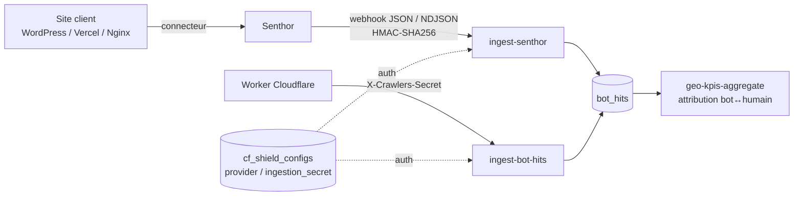

# Senthor — voie d'ingestion des hits bots (hors Cloudflare)

Complément technique de `senthor-api-request-fr.md` (message de demande d'accès).
Cette page documente ce qui est **déjà déployé** côté Crawlers.

## Vue d'ensemble

## Table `cf_shield_configs`

| Colonne | Rôle |
|---------|------|
| `provider` | `cloudflare` (défaut) \| `senthor` \| `custom` |
| `ingestion_secret` | Secret par site, sert de clé HMAC et de bearer header |
| `human_sample_rate` | Taux d'échantillonnage des hits humains (défaut `0.001`) |
| `status` | `pending` → `active` au premier hit reçu, `paused` = ingestion ignorée |
| `hits_total`, `last_hit_at` | Compteurs best-effort mis à jour à chaque lot |

Une seule config par `tracked_site_id`, quel que soit le provider.

## Endpoint `ingest-senthor`

- Public (`verify_jwt = false`), méthode `POST` uniquement.
- URL : `{SUPABASE_URL}/functions/v1/ingest-senthor`

### Authentification (au choix)

1. `X-Crawlers-Secret: <ingestion_secret>` — identique à `ingest-bot-hits`.
2. `X-Senthor-Signature: sha256=<hex>` + `X-Crawlers-Domain: <domain>`
   HMAC-SHA256 du corps brut, clé = `ingestion_secret` du site, comparaison en temps constant.

Sans l'un des deux → `401`.

### Corps accepté

Tableau JSON, NDJSON (une ligne = un événement), objet unique, `{ events: [...] }` ou `{ data: [...] }`.
Plafond : **500 événements par lot** (le surplus est ignoré silencieusement, `received` le signale).

### Mapping vers `bot_hits`

| Champ Senthor | Colonne `bot_hits` | Règle |
|---------------|--------------------|-------|
| `is_bot`, `bot_category` | `is_ai_bot`, `bot_family` | Senthor fait foi, `detectBot(ua)` en repli |
| `bot_name` | `bot_name` | repli `detectBot` |
| `ip` ou `ip_hash` | `ip_hash` | SHA-256 si IP en clair, préfixe `sha256:` retiré |
| `confidence` | `confidence_score` | 0..1 ou 0..100 → entier 0..100 |
| `verification_status` / `_method` | idem | défaut `unverified` / `senthor` \| `ua_pattern` |
| `ts` \| `timestamp` | `hit_at` | ISO 8601 ou epoch s/ms |
| `path` \| `url` | `path`, `url` | `url` reconstruite depuis le domaine si absente |
| `id`, `decision` | `raw_meta` | `{ source: 'senthor', senthor_id, decision }` |

Tous les hits bots sont conservés ; les hits humains sont tirés aléatoirement selon
`human_sample_rate` et marqués `is_human_sample = true` (nécessaires à la corrélation
bot ↔ humain de l'attribution GEO).

### Réponses

| Cas | Code | Corps |
|-----|------|-------|
| OK | 200 | `{ ok, processed, received, sample_rate }` |
| Site en pause | 200 | `{ ok: true, ignored: 'paused' }` |
| Corps illisible | 400 | `{ error: 'Body parse error: …' }` |
| Secret / signature invalide | 401 | `{ error: 'Invalid credentials' }` |
| Insert échoué | 500 | message Postgres |

## Rotation de secret

`cf-deploy-shield`, action `rotate` : régénère `ingestion_secret`, l'ancien est révoqué
immédiatement (aucune période de grâce). La consigne renvoyée dépend du provider —
redéploiement du Worker pour Cloudflare, mise à jour du header webhook pour Senthor.
Exposée par le bouton « Régénérer » sur `/cf-shield`.

## Écran `/cf-shield`

1. **Voie de collecte** : Worker Cloudflare ou Senthor, puis domaine.
2. **Configuration** : script Worker (Cloudflare) ou URL + header + format attendu (Senthor).
3. **Vérification** : attente du premier hit, `status` passe `pending` → `active`.

## Reste à faire

Brancher l'URL d'ingestion côté Senthor (webhook sortant) dès que l'accès partenaire est ouvert.
Si Senthor n'expose qu'une API pull, un cron côté Crawlers interrogera
`GET /v1/events?domain&since&cursor` et rejouera les lots vers `ingest-senthor` sans changement de schéma.
